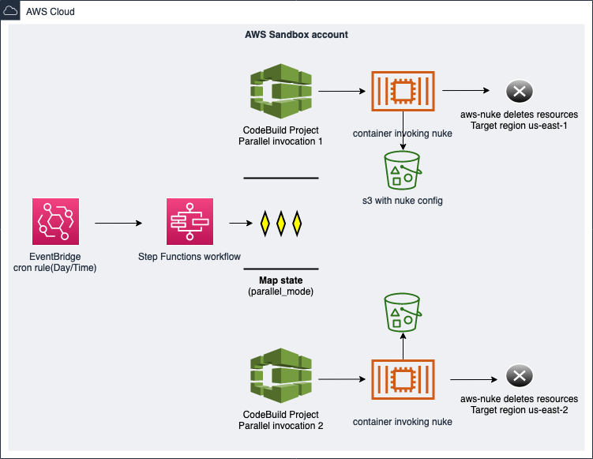

# AWS Account Cleanser framework using aws-nuke

### AWS Nuke is an open source tool created by rebuy.de
### https://github.com/rebuy-de/aws-nuke
### AWS Nuke searches for deleteable resources in the provided AWS acccount and deletes those which are not considered "Default" or "AWS-Managed"
### In short, it will take your account back to Day1 with few exceptions

The code in this repository helps you set up the following target architecture.

For prerequisites and instructions for using this AWS Prescriptive Guidance pattern, see [Automate deletion of AWS resources by using aws-nuke](https://docs.aws.amazon.com/prescriptive-guidance/latest/patterns/automate-deletion-of-aws-resources-by-using-aws-nuke.html).

## Security

See [CONTRIBUTING](CONTRIBUTING.md#security-issue-notifications) for more information.

## License

This library is licensed under the MIT-0 License. See the LICENSE file.

